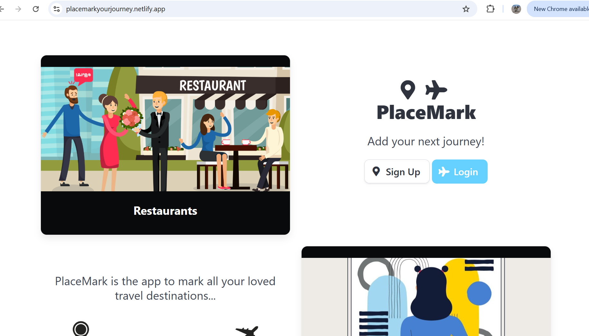
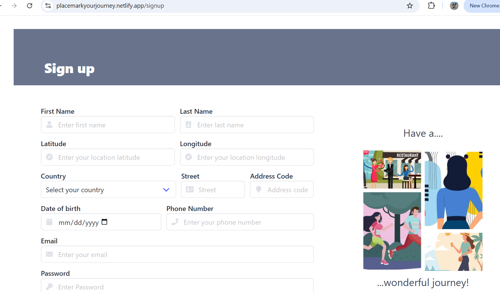
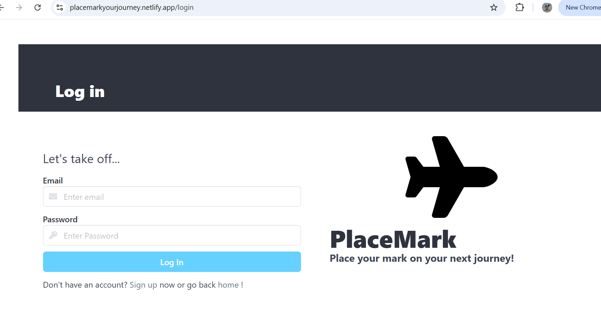
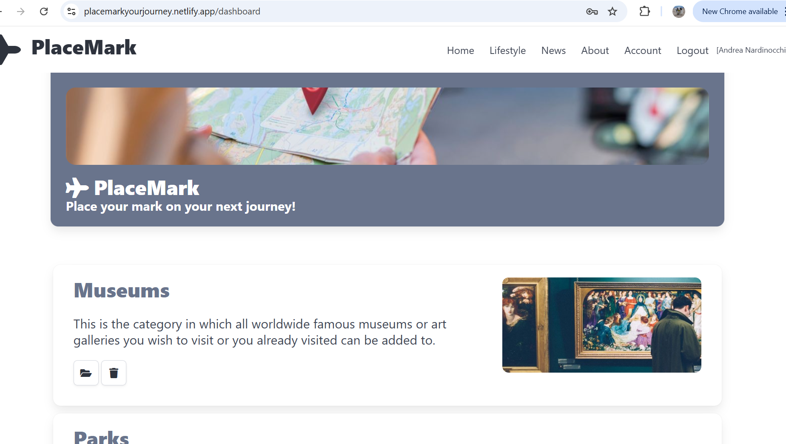
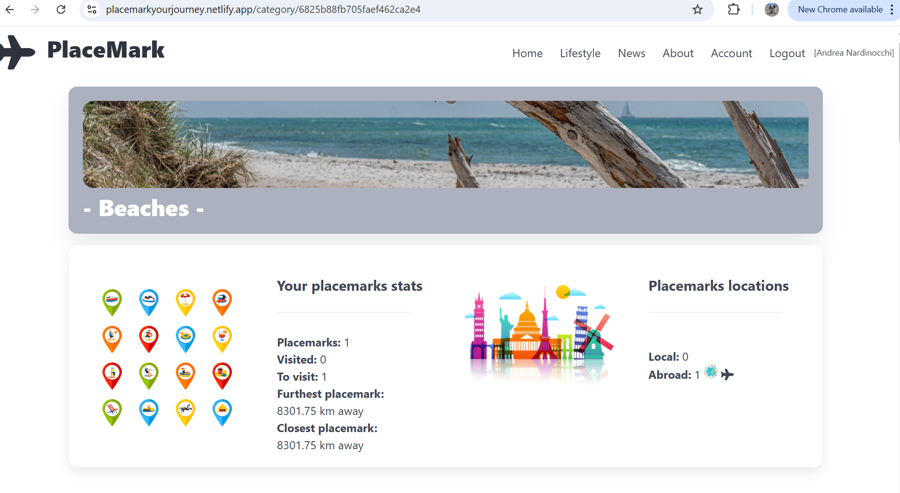
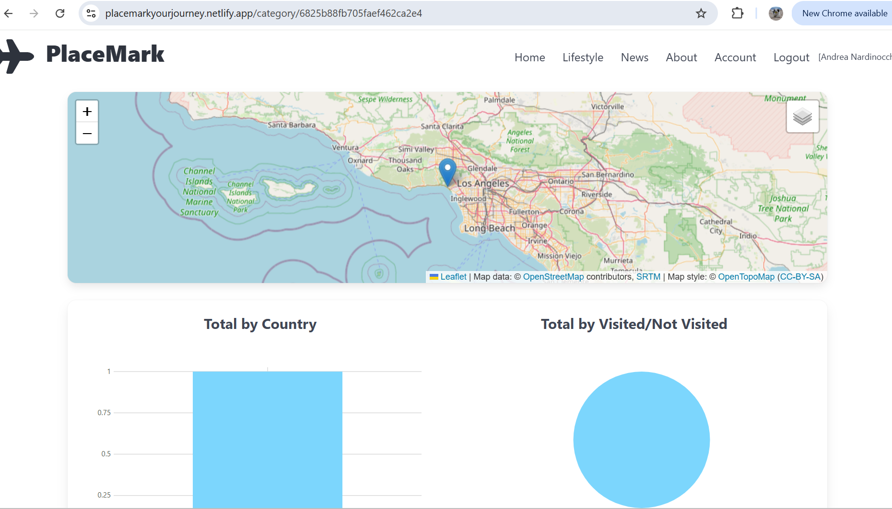
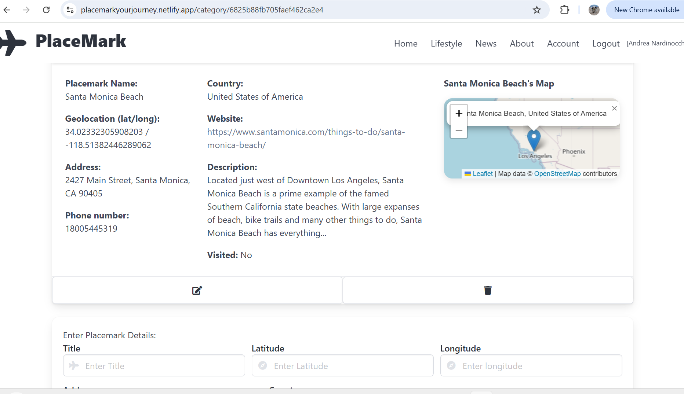
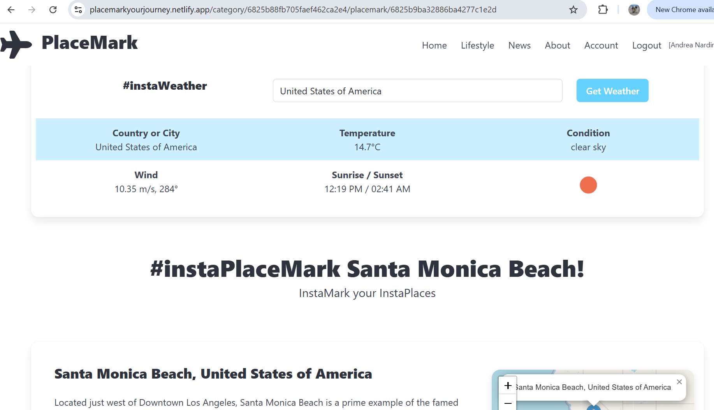
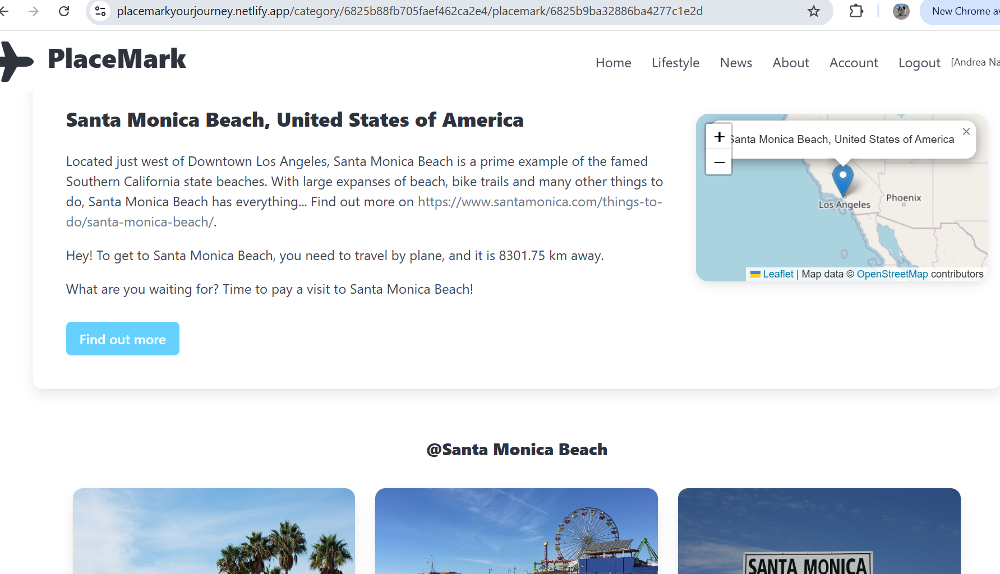

# Placemark Your Journey

**Placemark Your Journey** is a full-stack travel journaling app that allows users to record meaningful locations on a map. Users can upload images, write notes, and create list of destinations filtered in based upon their category. All API requests are authenticated using tokens stored securely in the browser's **localStorage**.

## Architecture Overview

This is a SvelteKit application that provides a responsive, modern frontend for managing travel experiences. The app communicates with a Hapi.js backend API that handles authentication, data persistence, and image storage.

**Frontend:** Built with SvelteKit, leveraging reactive components and built-in routing.

**Backend:** Powered by Hapi.js, handling RESTful endpoints and JWT authentication.

**Auth:** JWT tokens are stored in localStorage and included in Authorization headers.

**Storage:** MongoDB for database operations, and Cloudinary cloud service for image hosting.

## Live Demo

**Front End:**
https://placemarkyourjourney.netlify.app/
**Back End:** https://placemark-v63d.onrender.com/ / https://github.com/AndreaNardinocchi/placemark

---

## Features

- Interactive map with placemarks
- Upload and manage images for each location
- Group placemarks by categories (e.g., "Restaurants", "Museums", and so on)
- Token-based user authentication stored in `localStorage`
- Mobile-friendly responsive design Bulma framework

---

## Screenshots

https://placemarkyourjourney.netlify.app/

https://placemarkyourjourney.netlify.app/signup

https://placemarkyourjourney.netlify.app/login

https://placemarkyourjourney.netlify.app/dashboard

https://placemarkyourjourney.netlify.app/category/6825b88fb705faef462ca2e4

https://placemarkyourjourney.netlify.app/category/6825b88fb705faef462ca2e4/placemark/6825b9ba32886ba4277c1e2d

## Tech Stack

| Layer      | Tech                                 |
| ---------- | ------------------------------------ |
| Frontend   | Svelte kit Vite                      |
| State/Auth | JWT in `localStorage`                |
| Backend    | Hapi.js                              |
| Database   | MongoDB                              |
| Maps       | Leaflet.js                           |
| Hosting    | Netlify (frontend), Render (backend) |

---

## Authentication

Users log in with email and password.

Then, the JWT token returned from the server is stored in localStorage.

API requests use the token via the Authorization: Bearer <token> header.

## Contact

Got feedback or bugs? Reach out please on:
https://www.linkedin.com/in/andrea-nardinocchi-53084056/
